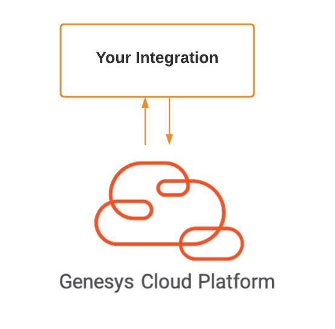
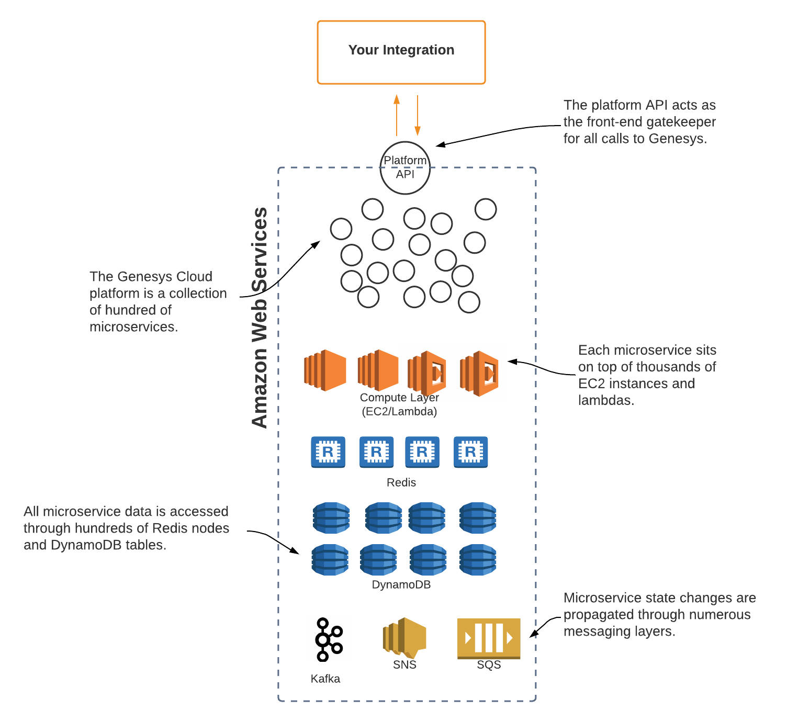
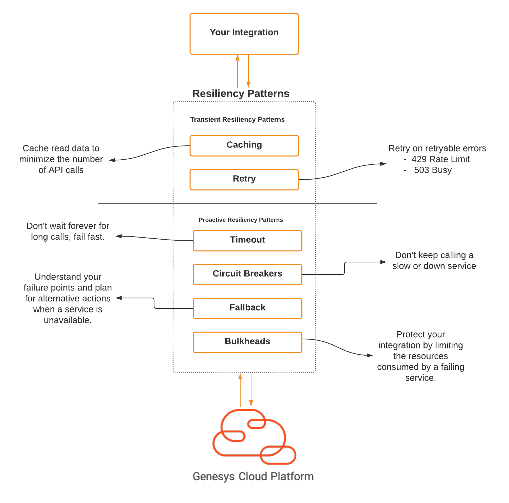

On the surface, building an integration to a Cloud-based platform often seems simple. Almost every cloud provider provides APIs and SDKs to call out to their platform and do some kind of action. For many, the conceptual work involved with designing their cloud-based integrations looks something like this:



However, the reality is that with any cloud integration, the cloud provider's APIs represents a complex set of microservices and infrastructure working together to deliver a robust and scalable set of features. When you call Genesys Cloud's public API, you are not calling a singular API, but instead calling a API Gateway that directs you to a robust set of services that have multiple instances running sitting on top of a number of cloud-based pieces of infrastructure. This combination of services and infrastructure is necessary to deliver a multi-tenant,cloud-based enterprise contact center platform.  The diagram below provides a general feel for the size and scope of the Genesys Cloud platform.



Cloud-based integration is by its very nature, distributed. This means that with a cloud-based solution you have to build your integrations to be able to handle interruptions and complete failures in service. Your goal in building your cloud-based integrations should be to:

1. __Fail fast__.  If a cloud-based service provider is having issues, you want to ensure that your integration calls notice the problem quickly and ensure that your integration does not continue to call a cloud-based service that is struggling. This allows you to fallback to alternative data sources and keeps a cloud service experiencing problems from being continually "hammered" with failing requests.

2. __Fail gracefully__. A well designed integration should fail gracefully and not completely crash when a cloud-provider it is using is experiencing difficulties. Different mechanisms for failing gracefully include providing alternative data stores and code paths when a failure is detected and including the ability for integrations to retry and self-heal when a cloud-provider returns to full health. 

3. __Stop the spread__. Every integration internally and externally within your organization's IT ecosystem represents an opportunity for failure. As you design your integrations you want to ensure that a failure in one integration does not cause a cascading effect that causes other systems to fail. 

Fortunately, there have been a number of resiliency patterns identified and documented to meet the three goals outlined above. In addition, there are multiple libraries and frameworks available across all modern, programming stacks to meet these goals.

# Resiliency Patterns in Action

There are 6 core resiliency patterns covered in this code example. Each of these patterns by themselves provide value and a good developer will often use a combination of patterns in their integrations. The diagram below shows the resiliency patterns we are going and how they can be "stacked" together:



Resiliency patterns can be classified into two groups:  __transient patterns__ and __proactive patterns__.  Transient patterns help an integration recover in the event of small interruptions of service where the service recovers quickly. Usually transient patterns are useful when dealing with rate-limiting (e.g 429 HTT status codes) and intermittent timeouts on the service (e.g. 502, 503 and 504s). These events are considered retryable.

Proactive patterns are used when you have a service that is failing and the service can not signal that its problems can be recovered from (e.g. a 500 status code). In this case, proactive patterns help your application fail fast, find alternative paths for carrying out their tasks and stopping the cascading spread of a service failure.

Based on the diagram above, we are going to cover 6 resiliency patterns in this code example:

1. __Caching__. Caching is used to minimize the number of calls to a downstream service. While caching has uses outside of resiliency, it can be used to improve resiliency by greatly reducing the calls to a cloud service provider and also allowing integrations to access data even if the downstream service is unavailable.

2. __Retry__. Retries are one of the fundamental patterns used for transient failures. With a retry pattern, you intercept key exceptions being returned by a service call and then attempt to call the targeted service X number of times with a backoff time period being applied between each call. 

3. __Timeouts__. Not all failures are spectacular incidents where a service is completely down. Instead, a service might be experiencing significant slowdowns in service calls. Timeouts allow you to kill a long-running connection before it starts tying up critical resources (e.g. threads) within your application.

4. __Circuit breakers__. Circuit breakers in software are used to protect your integration from slow and failing downstream services by detecting if a downstream is failing and not allow the integration to continue to call the service if the service call has failed enough times. Instead a circuit breaker will "pop" and then let occasional service invocations through to see if the service has recovered. Circuit breakers protect the resources an integration is using by failing fast and when combined with the fallback pattern, allow an integration to switch to seek alternative code paths in the event of a failure.

5. __Fallbacks__.  The Fallback pattern is used in conjunction with many other resiliency patterns (e.g. retry, timeout and circuit breaker patterns) and provides an alternative code path to be invoked when a service invocation fails within your integration. Fallbacks will typically read older data and default to less-then optimal action that will keep your integration functioning without failing completely. 

6. __Bulkheads__. The Bulkhead pattern models how cargo ships built. A cargo ship is divided into multiple watertight compartments and if one part of the ship is breached, the entire ship will not flood.  The Bulkhead pattern divides the service calls you are going to make into their own well-defined, bounded set of thread-pools. If one service's invocations are taking an extremely long time to respond, the slow-running service calls will only be able to consume the threads assigned to their thread pool. This prevents a slow running response from a service from consuming all of the resources threads with an integrations thread pool or operating system.

This code example provides example implementations of all of the above in the follow source files:

1. [Caching](https://github.com/MyPureCloud/resiliency-patterns-examples/blob/NO-JIRA-Initial-commit/src/main/java/com/genesys/resiliency/service/QueueServiceCacheFacade.java)
2. [Retrys](https://github.com/MyPureCloud/resiliency-patterns-examples/blob/NO-JIRA-Initial-commit/src/main/java/com/genesys/resiliency/service/QueueServiceRetryFacade.java)
3. [Timeouts](https://github.com/MyPureCloud/resiliency-patterns-examples/blob/NO-JIRA-Initial-commit/src/main/java/com/genesys/resiliency/service/QueueServiceTimeoutFacade.java)
4. [Circuit Breakers](https://github.com/MyPureCloud/resiliency-patterns-examples/blob/NO-JIRA-Initial-commit/src/main/java/com/genesys/resiliency/service/QueueServiceCircuitBreakerFacade.javal)
5. [Fallbacks](https://github.com/MyPureCloud/resiliency-patterns-examples/blob/NO-JIRA-Initial-commit/src/main/java/com/genesys/resiliency/service/QueueServiceFallbackFacade.java)
6. [Bulkheads](https://github.com/MyPureCloud/resiliency-patterns-examples/blob/NO-JIRA-Initial-commit/src/main/java/com/genesys/resiliency/service/QueueServiceStackedFacade.javal)
7. [All together](https://github.com/MyPureCloud/resiliency-patterns-examples/blob/NO-JIRA-Initial-commit/src/main/java/com/genesys/resiliency/service/QueueServiceStackedFacade.java)


# Pre-requisite
While all of the code examples for this developer starting guide should run in older versions of Java (Java 8+) and Maven, the code examples were built using.

- Java 11      
- Maven 3.6.0

# Install and run the code

To run the code you must do the following:

1. Setup an [OAuth2 Client Credential grant](https://help.mypurecloud.com/articles/create-an-oauth-client/) in your Genesys Cloud Organization. Make sure your OAuth2 client credential grant has the following permissions:
- routing:queue:view
- analytics:queueObservation:view
    
2. Retrieve the code from

3. Modify the `src/main/resources/application.yml` file and modify these specific properties to your reflect your organization's values: 
    
    ```
    genesys:
      region:    <<PUBLIC API REGION CODE e.g. "https://api.mypurecloud.com">>
      clientId:  <<OAUTH CLIENT CREDENTIAL GRANT CLIENT ID>>
      clientSecret:  <<OAUTH CLIENT CREDENTIAL GRANT SECRET ID>>
    ```
4. Once everything is setup you can run `mvn spring-boot:run`. This will launch the microservice.

# Code Directories and Files

All code for this resiliency integration project is available in the `src` directory. 

```
    src/
      main/java/com/genesys/resliency/
        controllers/                     <= Controller logic to handle incoming Web Requests
        config/                          <= All Spring Boot Config classes that define customer beans
        exception/                       <= Contains a RetryException that will be used for retryable exceptions
        init/                            <= Initialization code that is called to create the Genesys Cloud Connection
        proxy/                           <= Wrapper class around the Genesys Cloud API's being used for this project
        service/                         <= Contains the service class and individual facades to demonstrate each
                                            resiliency pattern.
      main/resources                     <= Contains the applications Spring Boot configuration file
```

# Alternative Resiliency Frameworks
If you are not developing your code using a JVM-based language there are still resiliency libraries specific to your application development language. Below is a non-exhaustive list of different resiliency frameworks.

|Language| Framework|Additional Notes |
|--------|----------|-----------------|
|.NET    | [Polly](https://github.com/App-vNext/Polly)| Full-fledged resilience library for .NET                |
|Golang  | [goresilience](https://github.com/slok/goresilience)| Implements most of the resiliency patterns uses in this starting guide          |
|Python  | [pybreaker](https://pypi.org/project/pybreaker/)|      Implements circuit breakers but not much else         |
|Node    | [Cocktiel](https://github.com/connor4312/cockatiel)|   Robust resiliency pattern library for Javascript              |
|Other   | [Envoy](https://www.envoyproxy.io/)        |     Alternative approach that uses a sidecar to implement resiliency patterns.  Language independent, but a more complex solution.            |
|Other   | [Istio](https://istio.io/)                 |   Alternative approach that uses a sidecar to implement resiliency patterns.  Runs well in a Kubernetes environment.  Highly complex, but extremely powerful.          |


# Additional Material
1. [Creating an OAuth Client Credential Grant](https://help.mypurecloud.com/articles/create-an-oauth-client/)
2. [Genesys Java SDK](/api/rest/client-libraries/javascript/)
3. Caffeine Cache](https://github.com/ben-manes/caffeine))
4. [Resiliency 4J](https://github.com/resilience4j/resilience4j)

